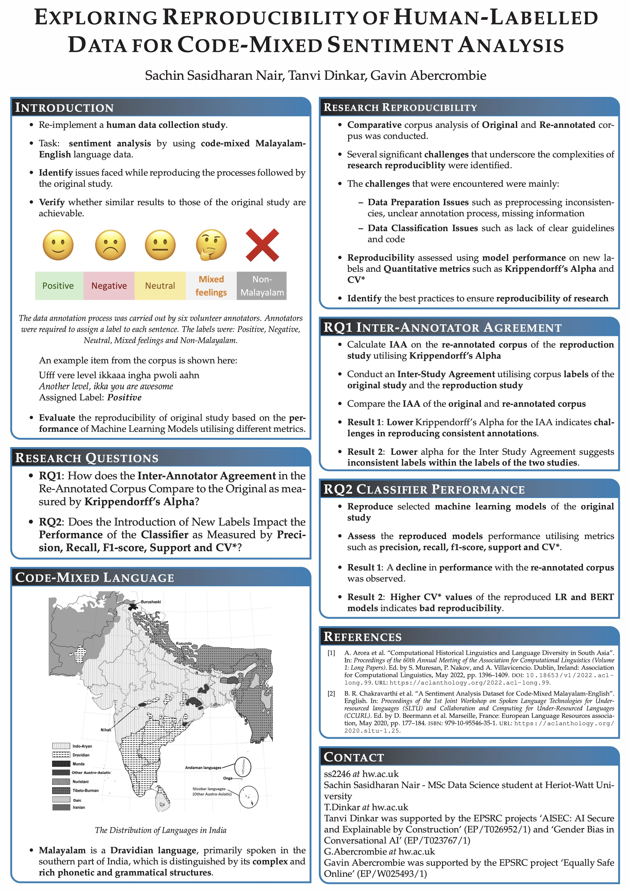

# Sentiment Analysis on Code-Mixed Malayalam-English Data

## Project Overview

This project is a reproducibility study of a sentiment analysis task on a code-mixed Malayalam-English dataset. The primary objective is to assess the reproducibility of the original study by Chakravarthi et al. (2020), focusing on human annotation and automated classification experiments. The study evaluates the challenges of replicating the original findings and explores the implications of label consistency on classifier performance.

  ## Final Outputs

- **[Research Paper](https://aclanthology.org/2024.humeval-1.11/)**
- **[Poster](poster/Poster.pdf)**

  

## Features

- **Re-annotation of the Test Set**:
  - The test set from the original corpus was re-annotated using a five-step process, enhancing the label accuracy.
  - Additional steps were introduced to handle instances with no consensus among annotators.

- **Comparative Analysis**:
  - The project includes a comparative analysis between the original and re-annotated corpora, examining differences in tokenization, label distribution, and sentence structure.

- **Classification Models**:
  - Two classifiers, Logistic Regression (LR) and BERT, were re-implemented to evaluate their performance on both the original and re-annotated datasets.
  - The study provides insights into how re-annotation impacts classifier performance, particularly focusing on the nuances captured by BERT.

- **Quantified Reproducibility Assessment**:
  - The reproducibility of the original study's results was assessed using quantitative metrics such as the coefficient of variation (CV*) and Krippendorff’s alpha (α).
  - The assessment highlights the challenges of achieving consistent results in NLP reproducibility studies.

## Datasets Used

- **Original Dataset**:
  - The original dataset consists of code-mixed Malayalam-English sentences extracted from YouTube comments on Malayalam movie trailers.
  - The dataset was initially filtered and preprocessed to exclude non-code-mixed content and very short or long sentences.

- **Re-annotated Dataset**:
  - The re-annotated test set, produced as part of this study, involves rigorous annotation steps to improve label consistency.
  - The re-annotated dataset is available as `Re-AnnotatedDataset.xlsx`.

## Annotation Process

- **Stage-wise Annotation**:
  - **Stage 1 and 2 Agreements**: Initial annotations by two annotators, with subsequent agreement checks.
  - **Stage 3 Agreement**: Disagreements from Stage 2 were resolved by a third annotator.
  - **Stage 4 and 5 Agreements**: Further annotations were done by additional annotators in case of disagreements.
  - **Stage 6 Agreement**: The final set of disagreements was resolved by a sixth annotator.
  - **Stage 7 Agreement**: Any remaining disagreements were resolved by the seventh annotator.
  - The annotations were organized in folders such as `Stage 1 and 2 Agreements`, `Stage 3 Agreements`, etc., and are compiled in `Re-AnnotatedDataset.xlsx`.

- **Annotation Process Details**:
  - The process involved splitting the dataset into several batches, with each batch undergoing the above stages of annotation.
  - The results of each annotation stage were recorded and analyzed to ensure consistency and accuracy.

## Methodology

- **Preprocessing**:
  - The preprocessing steps included emoji removal and sentence length adjustments. However, discrepancies were found between the reported and actual preprocessing steps in the original study.

- **Classification Models**:
  - **Logistic Regression (LR)**: Chosen for its simplicity and high performance in the original study. Implemented in the [Logistic Regression Notebook](notebooks/LR_OriginalAndNew_Datasets.ipynb).
  - **BERT (Bidirectional Encoder Representations from Transformers)**: A multilingual version was used due to its ability to handle code-mixed data. Implemented in the [BERT Notebook](notebooks/BERT_OriginalAndNew_Datasets_Updated.ipynb).

- **Quantitative Analysis**:
  - The study includes a detailed comparative analysis of the performance of the classifiers on the original and re-annotated corpora.

## Key Results

- **Annotation Reproduction**:
  - The re-annotation process led to significant shifts in label distribution, particularly for the "Mixed feelings" and "Non-Malayalam" labels.
  - Krippendorff’s alpha indicated moderate agreement between the original and re-annotated labels, suggesting variability in label consistency.

- **Classifier Performance**:
  - The BERT model showed a greater sensitivity to label changes compared to LR, reflecting its reliance on contextual and multilingual nuances.

- **Reproducibility Assessment**:
  - The study found moderate reproducibility in classifier performance when using the original corpus but noted a decrease when using the re-annotated corpus.
  - The coefficient of variation (CV*) and Krippendorff’s alpha (α) metrics provided a quantified assessment of reproducibility challenges.

## Tools and Libraries

- **Jupyter Notebooks**: Used for data analysis, preprocessing, and model implementation.
  - **[Preprocessing Notebook](notebooks/Prepping%20the%20Data.ipynb)**: Contains the preprocessing steps and dataset preparation.
  - **[Logistic Regression Notebook](notebooks/LR_OriginalAndNew_Datasets.ipynb)**: Implements and evaluates the Logistic Regression model.
  - **[BERT Notebook](notebooks/BERT_OriginalAndNew_Datasets_Updated.ipynb)**: Implements and evaluates the BERT model.
- **Microsoft Excel**: Employed for the manual annotation process.
- **Python Libraries**:
  - `sklearn` for Logistic Regression.
  - `transformers` for BERT implementation.
  - `nltk` for tokenization and preprocessing tasks.

## Project Structure

- `data/` - Contains the original and re-annotated datasets in `.xlsx` format.
- `notebooks/` - Jupyter notebooks for data analysis, preprocessing, and model training.
- `poster/` - The final research paper and the poster.
  - `Paper_Submission-3.pdf` - The final research paper.
  - `Poster.pdf` - The A3 map poster.
  - `image.jpg` - The thumbnail image for the poster.
- `Annotation Process/` - Contains folders for each stage of the annotation process, including disagreements and final agreements.
- `README.md` - This file.

## How to Run the Analysis

1. Clone the repository:

   ```bash
   git clone https://github.com/yourusername/sentiment-analysis-reproducibility.git
   ```

2. Navigate to the project directory:

   ```bash
   cd sentiment-analysis-reproducibility
   ```

3. Open the Jupyter notebooks to review the analysis and reproduce the experiments.

4. View the final research paper:

   Open the [Research Paper](https://aclanthology.org/2024.humeval-1.11/) to view the detailed research findings.

 

## License

This project is licensed under the MIT License - see the [LICENSE](LICENSE) file for details.
